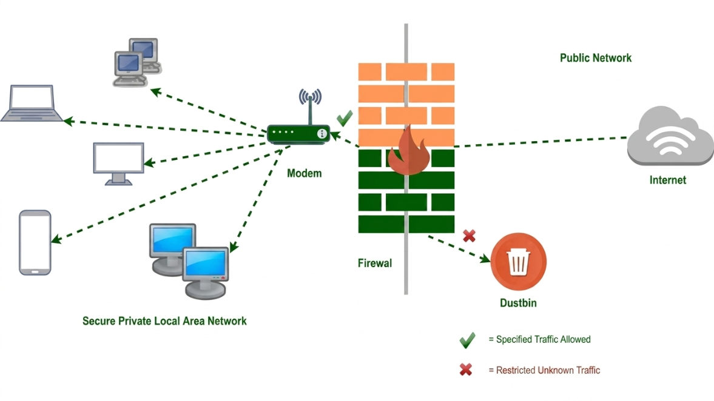

# 🛡️ Advanced Firewall with IDS, DoS Detection and Real-Time Monitoring

A Python-based intelligent firewall that combines packet filtering, intrusion detection, brute-force protection, DoS attack detection, port scan detection, and a real-time monitoring dashboard.

The project demonstrates how lightweight open-source technologies can be integrated to build a modular network security solution suitable for educational environments, small networks, and cybersecurity experimentation.

---

## Features

- Firewall Packet Filtering
- Intrusion Detection System (IDS)
- DoS Attack Detection
- Brute-force Login Detection
- Port Scan Detection
- Automatic IP Blocking
- Persistent JSON Block List
- SQLite Event Logging
- Flask Web Dashboard
- Real-time Monitoring

---

## Technologies Used

- Python
- Flask
- Scapy
- SQLite
- HTML5
- CSS3
- JavaScript
- JSON

---

## System Architecture


---

## Modules

### Firewall Engine

- Packet Inspection
- Rule-based Filtering
- Packet Blocking

### Intrusion Detection

- Brute-force Detection
- Port Scan Detection

### DoS Detection

- Traffic Rate Monitoring
- Automatic Source Blocking

### Database

- SQLite Storage
- Attack History
- Timestamp Logging

### Dashboard

- Live Blocked IP List
- Attack Logs
- Monitoring Interface

---

## Project Workflow

1. Capture network packets using Scapy.
2. Filter packets based on predefined firewall rules.
3. Detect suspicious activities such as brute-force logins, DoS attacks, and port scans.
4. Automatically block malicious IP addresses.
5. Store attack details in SQLite and a persistent JSON block list.
6. Display logs and blocked IPs through a Flask-based web dashboard.

---

## Installation

Clone the repository

```bash
git clone https://github.com/<your-username>/advanced-firewall-ids.git
```

Install dependencies

```bash
pip install -r requirements.txt
```

---

## Running

```bash
python app/main.py
```

Then open

```
http://127.0.0.1:5000
```

---

## Security Features

- Packet Filtering
- Intrusion Detection
- Brute-force Protection
- DoS Detection
- Port Scan Detection
- Persistent IP Blocking
- SQLite Logging
- Real-time Dashboard

---

## Future Improvements

- Machine Learning-based Anomaly Detection
- SSL/TLS Support
- Email and SMS Alerts
- Role-Based Authentication
- Threat Intelligence Integration
- ELK Stack Logging
- Docker Deployment
- Kubernetes Support
- Cloud Monitoring
- REST API Authentication

---

## Learning Outcomes

This project strengthened my understanding of

- Computer Networks
- Cybersecurity
- Firewall Design
- Intrusion Detection Systems
- Packet Analysis
- Flask Development
- SQLite
- Network Monitoring
- Threat Detection
- Secure System Design
